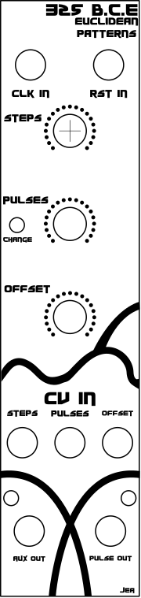

# 325BCE

 
Inexpensive DIY Euclidean Pattern Generator

Does the world really need another Euclidean Pattern Generator? 
Of Course Not! 
Will that stop me from making one? 
Of Course Not! 

This module is an inexpensive DIY Arduino Nano based module. Of course it could easily be built with an ATMEGA 328p or other similar IC, but you would need to add the crystal and associated parts. 

Depending on where you source the Nano, it should run less than $20 not counting a panel.  

Standard Disclaimer 
This is a DIY project, and you assume all responsibility for the use and construction of it. 

There are a lot of websites that explain Euclidean patterns, so I will not go into an explanation here. 

The module has two inputs: Clock and Reset. 
There are two outputs: Pulse out and AuxPulseOut 
There are three pots that change the number of steps, the number of pulses, and the offset. 
There is also a change LED that blinks each time a knob is turned to a new position 

There are three CV in jacks. The CV present at these jacks is added to the knobs. Any voltage less than 0 will be treated as zero and anything higher than 5V will be treated as 5V. So if you have the pulses knob at 0 and put 2.5V on the CV in, it is the same as the knob being at about the middle. 

There is a 2x5 pin header that lets you set options using jumpers.
By default, the module outputs 10ms pulses. This can be changed with the jumpers or in software. 

The steps go from 1 to 16 or 1 to 32 (depending on jumper setting). 
The pulses go from 0 to 16 or 1 to 32 
The offset has two modes. In the first mode, the offset goes from 0 to the number of steps -1. In the second mode, the offset is either 0 or 1, so it just shifts the pulse by one. 

A few design notes:
In keeping with the low budget, this design uses 5.1v Zener diodes to protect the inputs to the microprocessor instead of a more robust solution using an opamp, etc... I have tested the CV inputs with 20vpp for an extended period of time with no issues, but keep this in mind.  

325 BCE Bill of Materials								
<table>
<tr><td>ID</td><td>Name</td><td>Designator</td><td>Footprint</td><td>Quantity</td><td>Price Each</td><td>Total</td><td>Tayda Part</td><td>Tayda Link</td> </tr>
<tr>
<td>1</td>	<td>10u</td>	<td>C1</td>	<td>CAP-D5.0×F2.0</td> <td>1</td>	<td>$0.02</td>	<td>$0.02</td>	<td>A-3931</td>	<td>https://www.taydaelectronics.com/capacitors/electrolytic-capacitors/10uf-16v-85c-radial-electrolytic-capacitor.html</td>
</tr>
<tr>
<td>2</td>		<td>ZD 5.1 v 1N4733</td>	<td>D1,D2,D3,D4,D5</td>	<td>DO-41</td>	<td>5</td>	<td>$0.04</td>	<td>$0.20</td>	<td>A-169</td>	<td>https://www.taydaelectronics.com/1n4733-zener-diode-1w-5-1v.html</td>
<tr>
<td>3</td>		<td>DIP_SW</td>	<td>H1</td>	<td>HDR-F-2.54_2X5</td>	<td>2</td>	<td>$0.04</td>	<td>$0.08</td>	<td>A-5775</td>	<td>https://www.taydaelectronics.com/connectors-sockets/pin-headers/5-pin-2-54-mm-single-row-pin-header-strip.html</td>
<tr>
<td>4</td>		<td>Debug Jack</td>	<td>H2</td>	<td>HDR-F-2.54_1X2</td>	<td>1	</td><td>$0.04	</td><td>$0.04</td>	<td>A-5775	</td><td>https://www.taydaelectronics.com/connectors-sockets/pin-headers/5-pin-2-54-mm-single-row-pin-header-strip.html</td>
</tr>
<tr>
<td>5</td>		<td>Jacks</td>	<td>J1-7</td>	<td>THONKICONN</td>	<td>7</td><td>$0.23	</td><td>$1.61	</td><td>A-2563	</td><td>https://www.taydaelectronics.com/hardware/3-5mm-plugs-jacks/pj-3001f-3-5-mm-mono-phone-jack.html</td>
</tr>
<tr>
<td>6</td>		<td>3mm LED</td><td>	LED1-3</td>	<td>LED-TH_BD3.0_RED</td>	<td>3</td>	<td>$0.02</td>	<td>$0.06	</td> <td>A-261	</td><td>https://www.taydaelectronics.com/leds/round-leds/3mm-leds/led-3mm-red.html</td>
</tr>
<tr>
<td>7</td>		<td>Arduino Nano</td> <td>M1</td><td>NANO</td>	<td>1	</td><td>$10.00</td>	<td>$10.00	</td>	<td></td><td>Get from Amazon, Ali, etc…</td>
</tr>
<tr>
<td>8</td>		<td>Pots</td><td>	P1</td><td>	ALPHA9MM</td>	<td>3	<td>$1.29</td>	<td>$3.87</td>	<td>A-1847</td>	<td>https://www.taydaelectronics.com/potentiometer-variable-resistors/rotary-potentiometer/linear/10k-ohm-linear-taper-potentiometer-round-shaft-pcb-9mm.html</td>
</tr>
<tr>
<td>9</td>		<td>PWR</td>	<td>PWR1</td><td>	EURORACK SHROUDED POWER 10 PIN</td>	<td>1</td> <td>$0.50</td><td>$0.50	</td>	<td></td><td>Get from Amazon, Ali, etc…</td>
</tr>
<tr>
<td>10</td>		<td>1k</td> <td>R1,R2,R3,R5,R8</td>	<td>R_AXIAL-0.3</td>	<td>5</td>	<td>$0.02	</td><td>$0.08	</td><td>A-2200	</td><td>https://www.taydaelectronics.com/resistors/1-4w-metal-film-resistors/10-x-resistor-1k-ohm-1-4w-1-metal-film-pkg-of-10.html</td>
</tr>
<tr>
<td>11</td>		<td>220</td> <td>	R4,R6,R7</td>	<td>R_AXIAL-0.3</td>	<td>3	</td><td>$0.02</td>	<td>$0.06	</td><td>A-2246	</td><td>https://www.taydaelectronics.com/resistors/1-4w-metal-film-resistors/resistor-220-ohm-1-4w-1-metal-film-pkg-of-10.html</td>
</tr>
<tr>
<td>12</td>		<td>100k	<td>R9,R10</td>	<td>R_AXIAL-0.3</td>	<td>2	</td><td>$0.02</td>	<td>$0.04	</td><td>A-2248</td><td>https://www.taydaelectronics.com/resistors/1-4w-metal-film-resistors/10-x-resistor-100k-ohm-1-4w-1-metal-film-pkg-of-10.html</td>
</tr>
<tr>
<td>13</td>		<td>Jumper</td>	<td></td><td></td>		<td>5	<td>$0.02	</td><td>$0.10</td>	<td>A-1324</td>	<td>https://www.taydaelectronics.com/connectors-sockets/pin-headers/mini-jumper-2-54mm-gold-plated-closed-cover.html</td>
</tr>
<tr>
<td></td><td></td><td></td><td></td><td></td><td></td><td>$16.16</td><td></td><td></td>
</tr>
</table>
						
 								
Notes: 	R4,R6,R7 Set the brightness for the LED. 220 is usually fine for red LEDs, 
but if you use bright ones like blue, you may want to change to 1k. Adjust as you prefer.  
For the pots, you can use 1k,2k,5k or 10k. You can use Alpha pots with knobs or you can use trimmer pots.						

